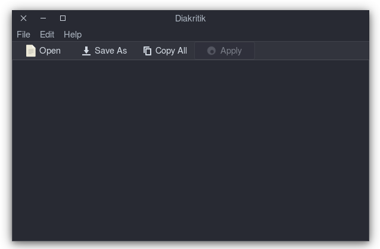

# Uživatelská Dokumentace
## Instalace
### Linux
Pro úspěšnou instalaci je potřeba mít nainstalovaný kompilátor g++ s podporou c++17. Dále je potřeba knihovna gtkmm-3.0. Na distribucích Debian ji nainstalujete příkazem:
```
sudo apt-get install libgtkmm-3.0-dev
```
Po úspěšném nainstalování potřebný balíčků stačí zkopírovat celý repozitář a ve složce src/app spustit příkaz `make` (pokud ho nemáte obvykle stačí doinstalovat balíček `build-essential`)
```
git clone https://github.com/Breta01/diaktritik.git
cd diakritik/src/app
make
```
Po to budete mít v této složce spustitelný soubor s názvem "diakritik", jehož spuštěním spustíte aplikaci. Můžete také provést příkaz `make install`, který přidá desktop entry do vašeho lokálního adresáře, což umožní snadný přístup k aplikaci pomocí nástrojové lišty.

### Windows
Spouštění na Windows zatím nebylo testováno, ale mělo by být možné po installaci c++ s gtkmm.

## Ovládání
Po spuštění se objeví jednoduché okno. Většinu okna zabírá textové pole, do kterého je možné psát a vkládat text. V nabídce jsou některé základní operace: načtení textu ze souboru, uložení do souboru, zkopírování celého textu a další.



Na hlavní liště je také tlačítko "apply". Po spuštění je tlačítko neaktivní dokud program nenačte potřebná data (obvykle trvá okolo 6 sekund, ale může trvat déle), během této doby můžete připravit upravovaný text. Jakmile je tlačítko aktivní a v textovém poli máte text, který chcete doplnit o diakritiku, můžete na tlačítko kliknout.


Po aktivaci tlačítka bude text z textového pole nahrazen textem doplněným o diakritiku. Tato operace mimo jiné zachovává velikost písmen z původního textu.
